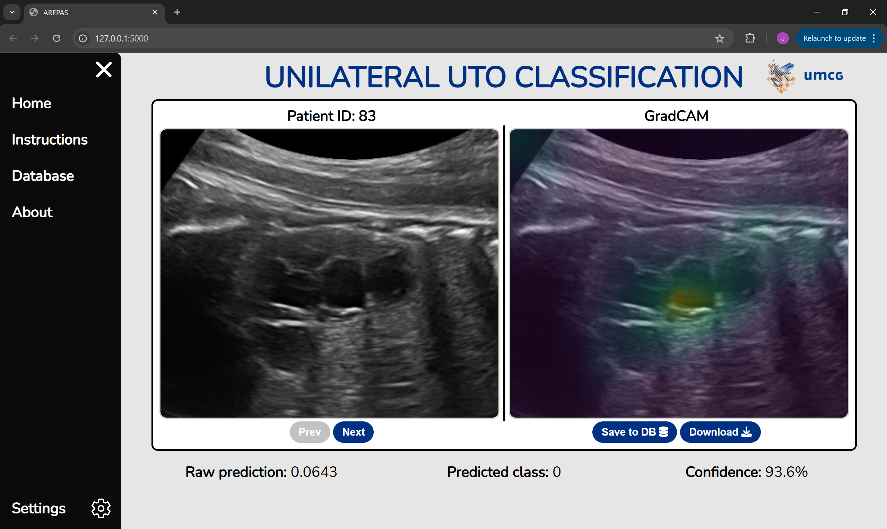

# DL and XAI prediciton GUI for the AREPAS project
Simple, Flask-based, deep learning and explainable AI prediction web GUI made for the AREPAS project. Its main purpose is to enable clinicians involved in the project to use and experiment with the already trained models.

## Packages used
Tensorflow 2.18.1  
tf-explain 0.3.1 (modified)  
Flask 2.2.5  